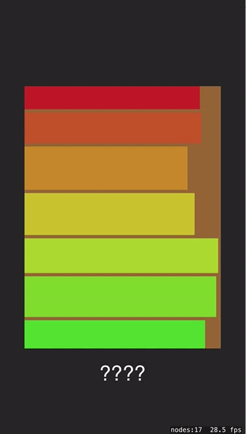
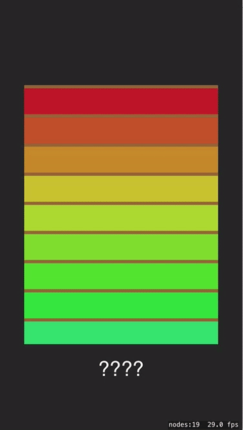

# Scrolling-List

This is a simple scrolling list that can be used with SpriteKit. 
This is not a replacement for the UITableView. This provides 
only a simple mechanism for scrolling a list sprite nodes. 

 
The list arranges all sprites in a vertical list. Sprites 
can be aligned to the left, right, or center. 
 
When initializing a list you will set it's size. This will 
determine the visible area for scrolling elements. 
 
Initialize with a size like this: 
 
    list = ScrollingList(size: CGSize(width: 300, height: 400))
 
Add sprite nodes as scrolling elements: 
 
    list.addNode(sprite)
 
Set the Alignment mode: .Left, .Right, .Center

    list.horizontalAlignmentMode = .Left

Set the background Color

    list.color = UIColor.brownColor()

Handle taps on rows by setting the delegate and implementing the ScrollingListdelegate protocol.

Declare the delegate at the top of your GameScene:

    class GameScene: SKScene, ScrollListDelegate

Assign this class as the delegate for the List.

    list.delegate = self

Implement the protocol: 

    func selectedRowNode(node: SKSpriteNode) {
        // Check the node name to decide what to do here...
        print("Selected Row: \(node.name)")
        if node.name != nil {
            label.text = node.name
        }
    }

ScrollingList sends a selectedRowNode() message to it's delegate when a row is selected. 
Note that dragging and tapping both involve touching a row. To differentiate between 
tapping a row and scrolling the list, the list measures the distance from the start of a drag, 
if the distance is less that 10 points selectedRowNode() is sent to the delegate.

